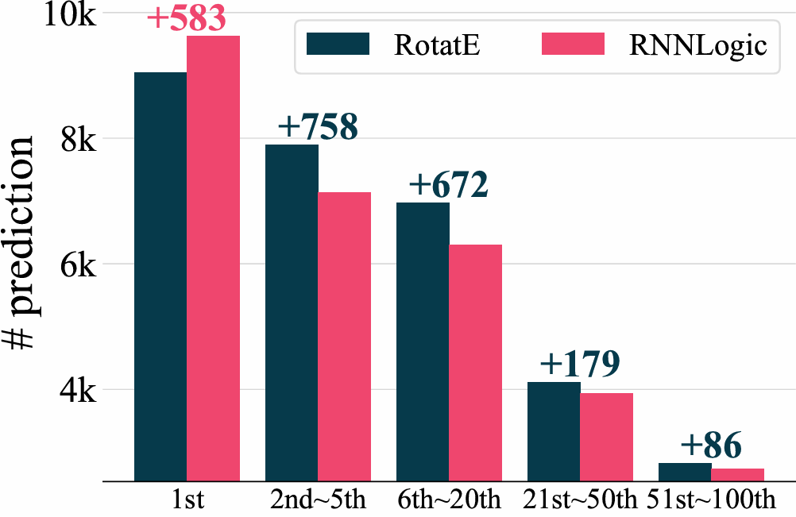
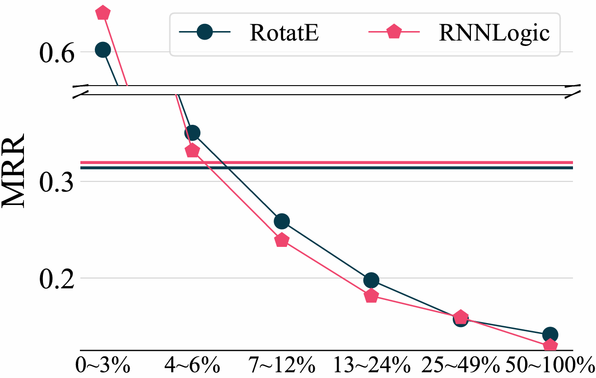
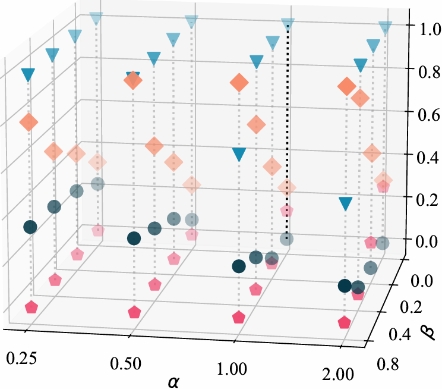
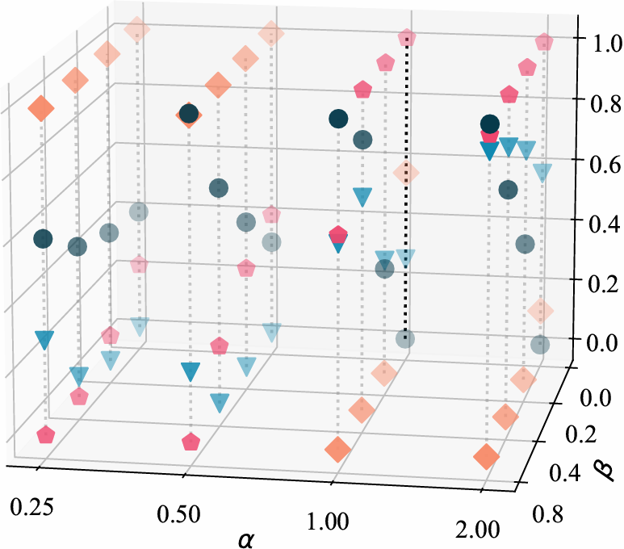

# [WSDM'26] How Sharp and Bias-Robust is a Model? Dual Evaluation Perspectives on Knowledge Graph Completion

This repository provides an implementation and adaptation of PROBE on existing models.

## The overview of PROBE
### Observation 1 & 2

  
  

### Experiments on FB15k-237 & WN18RR

  
  

## 4 models
The original source code for each model is as follows

● RotatE [[Link](https://github.com/DeepGraphLearning/KnowledgeGraphEmbedding)]
▼ TuckER [[Link](https://github.com/ibalazevic/TuckER)]
◆ pLogicNet [[Link](https://github.com/DeepGraphLearning/pLogicNet)]
⬟ RNNLogic [[Link](https://github.com/DeepGraphLearning/RNNLogic)]

Since the original embedding dimensions were too large (up to 1000), we lacked the computational resources to run the models. Therefore, we standardized all embedding dimensions to 128, except for those that were already below this threshold, and re-tuned the corresponding hyperparameters.

All requirements and best configurations are located in each model directory. Researchers or practitioners facing similar limitations (e.g., memory) are welcome to use our optimized configurations freely.

## Evaluation Protocal
We follow the commonly adopted [filtered setting](https://papers.nips.cc/paper_files/paper/2013/file/1cecc7a77928ca8133fa24680a88d2f9-Paper.pdf) and [tie breaking](https://arxiv.org/pdf/1911.03903) protocol for fair evaluaiton.

## probe.py
The python file contains the implementation of PROBE. Each of the 4 models use probe.py for evaluation along with their original evaluations(MR, MRR, Hits@k).

Since probe.py is outside the model directories, it is crucial to run the below line first before any other part of the code that is related to evaluation is executed.
<pre><code>export PYTHONPATH=$(pwd)/..
</code></pre>
Although this line is already specified inside every run.sh file, make sure it is present.

## Acknowledgement
We thank the original authors for their great works.